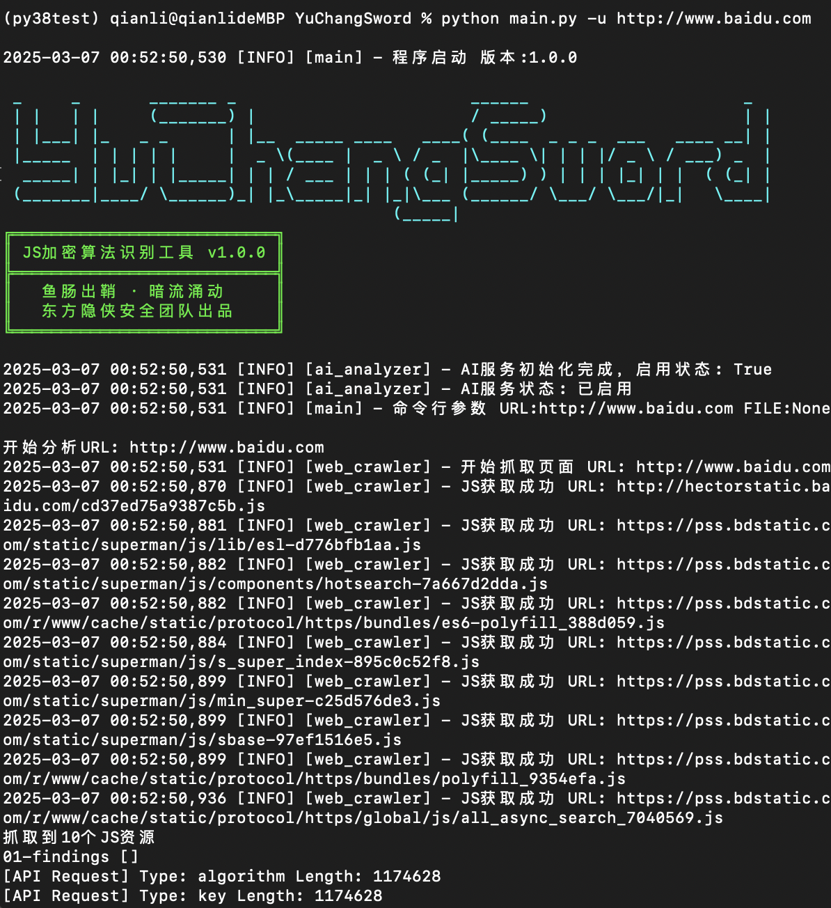
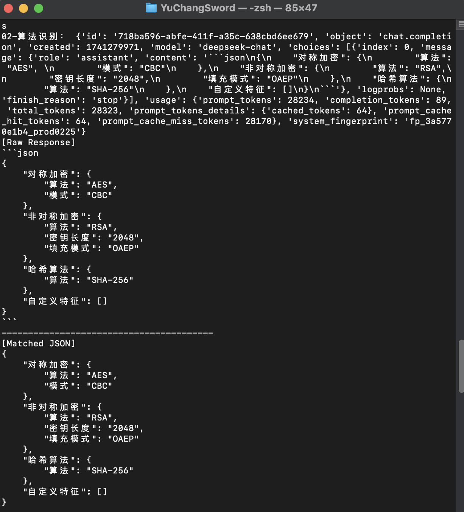
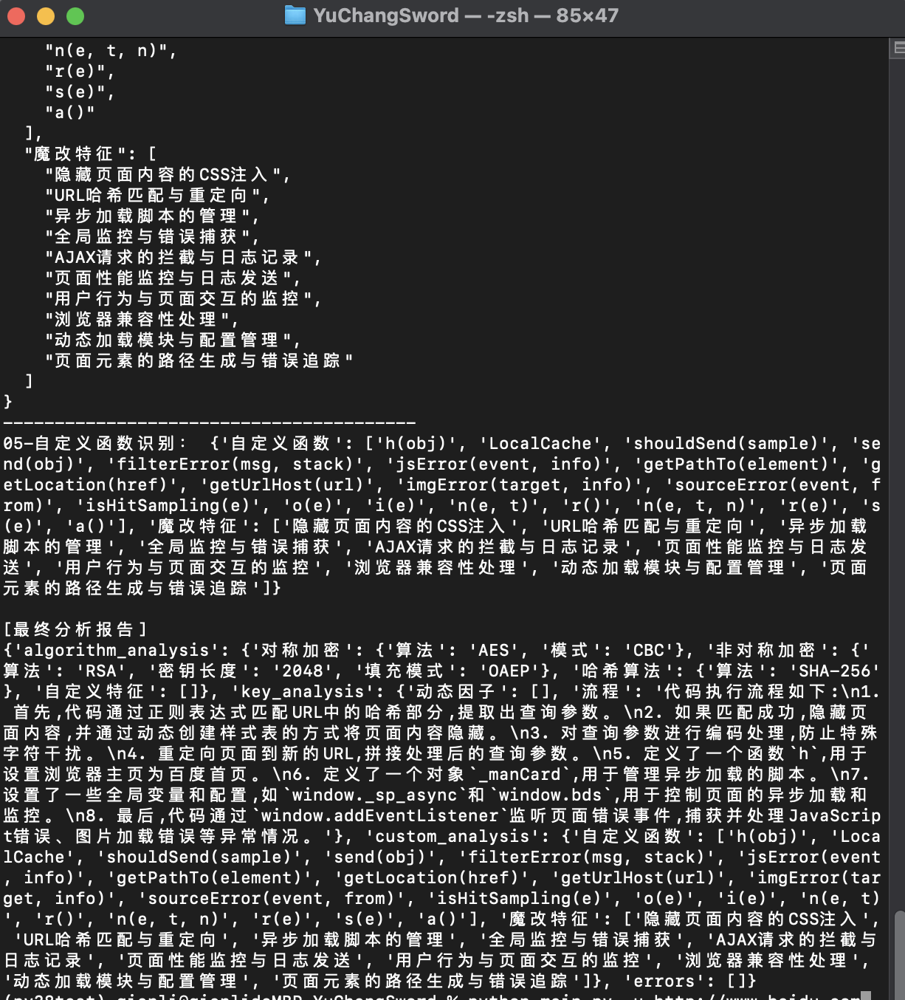

使用方法：
1. 环境要求
```
Python >= 3.8
```

2. 下载源代码
```
git clone https://github.com/EastSword/YuChangSword.git
```

3.进入代码目录，安装环境依赖文件

```bash
cd YuChangSword
pip install -r requirements.txt
```
如有其他报错，根据相关建议解决即可，此处应该没坑

3. 向操作系统环境变量中写入DeepSeek密钥
```bash
#Linux/MacOS
在 ~/.bashrc 或 ~/.zshrc 文件末尾添加：
export DEEPSEEK_API_KEY="sk-your-real-key-here"

#Windows
通过系统属性 -> 高级 -> 环境变量 添加用户级变量
```

4. 调用方法：
```bash
python main.py [-u/-f] target
-u，--url, 待分析的网页URL
-f', --file, 本地JS文件路径

如：
python main.py https://www.baidu.com
python main.py test_asymmetric.js
```

5. 页面输出

（1）输入目标


（2）过程输出


（3结果输出）


下一步优化：
1. 根据实际工作需求，增加算法识别内容
2. 优化结果输出格式，结果中体现过程中具体js路径